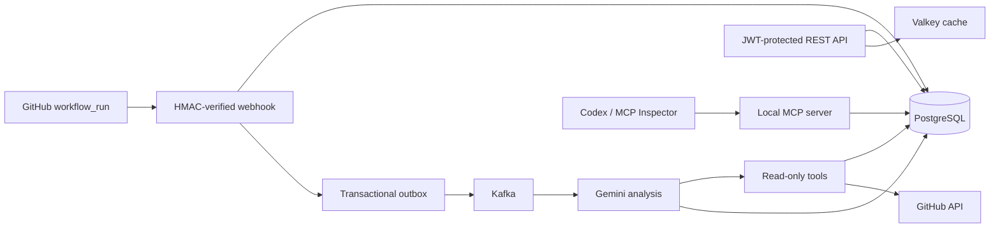

# CIght

CIght is an API-first CI/CD observability platform. It receives signed GitHub
Actions workflow events, stores build history, publishes failure-analysis
requests through Kafka, and uses Gemini either as a regular model call or as an
agent that can inspect historical failures, commit context, and repository
instability.

The application is intentionally a modular monolith: its feature boundaries can
be extracted later, while one deployable keeps local development and learning
manageable.

## Architecture



The database transaction persists both the analysis request and its outbox
event. The publisher can send an event more than once if it crashes after Kafka
accepts the message but before PostgreSQL records publication. Consumers are
therefore idempotent by analysis ID/request key. This is **at-least-once
delivery**, not exactly once.

## Stack

- Java 21, Spring Boot 4.0.5, Maven Wrapper
- PostgreSQL 17 and Flyway
- Apache Kafka in KRaft mode
- Valkey/Redis-compatible caching
- Spring AI 2.0 with Gemini
- Spring AI MCP Streamable HTTP server
- Spring Security OAuth2 Resource Server with Auth0 JWTs
- OpenAPI/Swagger UI
- Testcontainers, JUnit, Mockito, MockMvc

## Quick start

### Prerequisites

- Java 21
- Docker Desktop or another Docker-compatible engine
- No separate Maven installation

Copy the environment template:

```bash
cp .env.example .env
```

Start the complete local system:

```bash
docker compose up --build
```

The API is available at:

- API: `http://localhost:8028`
- Swagger UI: `http://localhost:8028/swagger-ui.html`
- Health: `http://localhost:8028/actuator/health`
- MCP: `http://localhost:8028/mcp`

To run only infrastructure and start Java from IntelliJ:

```bash
docker compose up -d postgres kafka valkey
sh ./mvnw spring-boot:run
```

### Reset the pre-Flyway learning database

The original prototype allowed Hibernate to create its table. The new schema is
fully owned by Flyway and intentionally starts clean:

```bash
dropdb --if-exists cight
createdb --owner=cightuser cight
```

Do not run those commands against a database whose records must be retained.

## Configuration

All secrets are environment variables. Never commit `.env`.

| Variable | Purpose | Local default |
|---|---|---|
| `DATABASE_URL` | PostgreSQL JDBC URL | `jdbc:postgresql://localhost:5432/cight` |
| `DATABASE_USERNAME` | Database role | `cightuser` |
| `DATABASE_PASSWORD` | Database password | `cightpass` |
| `KAFKA_BOOTSTRAP_SERVERS` | Kafka brokers | `localhost:9092` |
| `REDIS_URL` | Valkey/Redis connection | `redis://localhost:6379` |
| `GITHUB_WEBHOOK_SECRET` | HMAC secret shared with GitHub | local-only placeholder |
| `GITHUB_TOKEN` | Optional token for commit-context API calls | empty |
| `GEMINI_API_KEY` | Gemini Developer API key | empty |
| `AI_ENABLED` | Enable real model calls | `false` |
| `AI_CHAT_MODEL` | Spring AI model provider | `none` |
| `GEMINI_MODEL` | Gemini model | `gemini-2.5-flash` |
| `SECURITY_ENABLED` | Require Auth0 JWTs | `false` locally |
| `AUTH0_ISSUER_URI` | Auth0 tenant issuer | none |
| `AUTH0_AUDIENCE` | Expected JWT audience | `https://api.cight.dev` |
| `MCP_ENABLED` | Start local MCP server | `true` locally |

For Gemini:

```bash
AI_ENABLED=true
AI_CHAT_MODEL=google-genai
GEMINI_API_KEY=your-key
```

## REST API

### Builds and analytics

| Method | Path | Scope | Behavior |
|---|---|---|---|
| `POST` | `/api/builds` | `builds:write` | Create a validated build |
| `GET` | `/api/builds` | `builds:read` | Paginated/filterable builds |
| `GET` | `/api/builds/{id}` | `builds:read` | Get one build |
| `GET` | `/api/analytics?repoName=owner/repo` | `builds:read` | Aggregated metrics |

Success rate is:

```text
success / (success + failure) × 100
```

Pending, cancelled, and unknown builds are not outcomes. Success rate and
average duration are `null` when no qualifying measurements exist.

### AI analyses

| Method | Path | Scope |
|---|---|---|
| `POST` | `/api/builds/{id}/analyses` | `analyses:write` |
| `GET` | `/api/builds/{id}/analyses` | `builds:read` |
| `GET` | `/api/analyses/{id}` | `builds:read` |
| `POST` | `/api/analyses/{id}/retry` | `analyses:write` |

Request either analysis mode:

```json
{"mode":"BASELINE"}
```

```json
{"mode":"AGENTIC"}
```

Baseline mode receives only the sanitized build context. Agentic mode may call:

- `queryPastFailures`
- `getCommitContext`
- `calculateRepoInstabilityScore`

Both modes return immediately with HTTP `202`; Kafka performs the analysis
asynchronously.

## GitHub webhook

Configure a GitHub repository webhook:

- URL: `https://your-host/webhook/github`
- Content type: `application/json`
- Secret: the same value as `GITHUB_WEBHOOK_SECRET`
- Event: **Workflow runs**

CIght verifies `X-Hub-Signature-256` against the raw request body, records
`X-GitHub-Delivery` for idempotency, accepts `ping`, and processes completed
`workflow_run` events. Only failures trigger automatic agentic analysis.

GitHub's workflow-run webhook does not contain the full Actions log archive.
For webhook-created failures, agent evidence is therefore commit context and
historical CIght data unless a build log is supplied through the build API.

## MCP

MCP is enabled only in the local profile. It exposes four read-only tools:

- `get_build`
- `list_recent_failures`
- `get_repo_analytics`
- `get_failure_analysis`

Start MCP Inspector and connect it to `http://localhost:8028/mcp`:

```bash
npx @modelcontextprotocol/inspector
```

To connect Codex, add this project-scoped configuration to
`.codex/config.toml` or the equivalent block to `~/.codex/config.toml`:

```toml
[mcp_servers.cight]
url = "http://localhost:8028/mcp"
enabled = true
enabled_tools = [
  "get_build",
  "list_recent_failures",
  "get_repo_analytics",
  "get_failure_analysis"
]
default_tools_approval_mode = "auto"
tool_timeout_sec = 30
```

Restart Codex after changing MCP configuration. Use `/mcp` in the Codex CLI
to inspect connected servers. Remote MCP is disabled because OAuth for that
surface is intentionally outside this version.

## Auth0

Create an Auth0 API with identifier `https://api.cight.dev`, then grant these
permissions to a test client:

- `builds:read`
- `builds:write`
- `analyses:write`

The cloud profile validates JWT signature, issuer, audience, expiry, and scopes.
The GitHub webhook, health endpoint, and API documentation remain public.

## Testing

```bash
sh ./mvnw test
```

Unit and web tests never call Gemini or GitHub. The Flyway integration test uses
Testcontainers and skips automatically when Docker is unavailable.

## Free cloud deployment

The included `render.yaml` deploys the Docker image to a Render free web
service. Create free Aiven PostgreSQL, Kafka, and Valkey services and map their
TLS connection values to the environment variables above. Use Auth0 for JWT
issuance and Gemini Developer API for model access.

Free-tier constraints are part of the demo:

- Render may cold-start after inactivity.
- Aiven Kafka may stop after 24 hours without produce/consume traffic; wake it
  from the Aiven console before a demo.
- Free services have limited storage, throughput, and no production SLA.

The deployed application is a portfolio system, not a production service.

## Demo script

1. Wake the cloud application and Kafka service.
2. Trigger a failing GitHub Actions workflow.
3. Show the signed webhook creating one build.
4. Show the outbox event being published to Kafka.
5. Poll the analysis endpoint until the agentic result is complete.
6. Request a baseline analysis for the same build and compare tools/evidence.
7. Ask Codex through MCP for repository analytics and the latest diagnosis.

## Future extraction path

The package boundaries map to future deployables:

- `webhook` → ingestion service
- `build` + `outbox` → pipeline service
- `analytics` → read-model service
- `analysis` → AI worker
- `mcp` → secured integration gateway

Extraction should happen only when independent scaling, ownership, or deployment
needs justify the operational cost.
